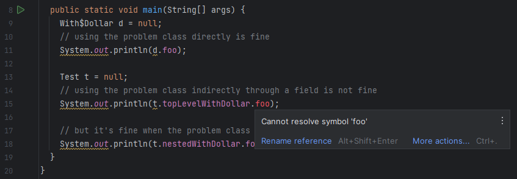

This repository is a minimal reproducible case for a bug in Intellij.

The conditions for the problem as demonstrated here are

1. a field references a class with a dollar sign (`$`) in the name
2. the class is defined in a separate class to the field
3. all classes being used as a dependency in `jar` form

### Steps to reproduce

1. Run `mvn clean install` on the top-level pom and confirm it completes successfully
2. Open this project in IntelliJ (IntelliJ IDEA 2023.2.1 (Ultimate Edition) Build #IU-232.9559.62)
3. Open `Main.java` and observe the failure to resolve type information on `t.topLevelWithDollar`
    1. If none of the types from `org.example.test` are resolving, open `depender/pom.xml`, tweak
       any property (e.g. the artifactId of dependency to `dependee`), load maven changes

### Issue Raised

[YouTrack](https://youtrack.jetbrains.com/issue/IDEA-339385/Unresolved-type-for-class-with-dollar-sign-in-jar-dependency)
